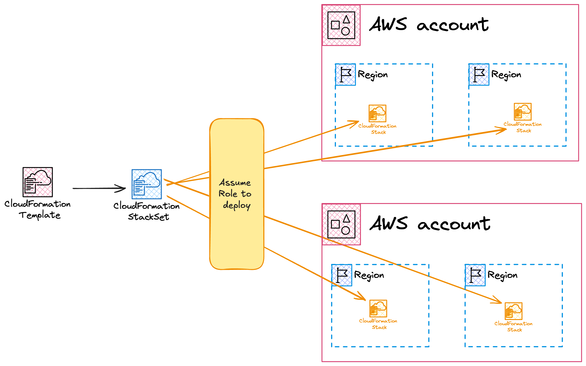
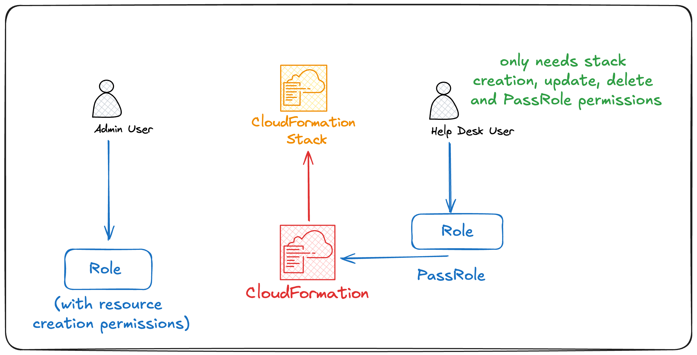

# Cloudformation

Infrastructure as Code service defined in YAML or JSON, in what are called **templates**.

## Terms and Limitations

- **Logical resources**: The resource that is defined in the template.
- **Physical resources**: The actual created logical resource that is defined in the template.
- A stack is deployed to 1 Account in 1 Region

## Portability
It is important to make templates **portable** between regions, accounts, and the number of times it can be deployed. To do that we can use the following features and constructs.

### Template Parameters
- Are passed when a template is created / updated.
- Can be referenced within logical resources.
- Can be configured with:
    - defaults, allowed values, min/max, allowed patterns, no echo (masks them in console output and logs), data type.

### Pseudo Parameters
- Are injected by AWS, they include:
    - `AWS::Region`, `AWS::StackId`, `AWS::StackName`, `AWS::AccountId`

## Intrinsic Functions
- `Ref` and `Fn::GetAtt` -> Reference logical resources within a template
- `Fn::Join` and `Fn::Split` -> To join and split strings
- `Fn::GetAZs`, and `Fn::Select` -> To get availability zones and select elements from a list
- `If`, `And`, `Equals`, `Not`, `Or` -> For conditionals. Can control config values, or even if resources get created.
- `Fn::Base64` and `Fn::Sub` -> Allows you to pass strings as values and replace values with sub.
- `Fn::Cidr` -> To create a Cidr range in VPCs. Used to split and assign Cidr ranges from a VPC to subnets
- `ImportValue`, `FindInMap`, `Transform`

### Mappings
One template can contian many mappings. It's a key value store that can be up to two level deep. You can retrieve values using `Fn::FindInMap`

### Outputs
You can optionally output values from a stack.
Those outputs are accessible from a parent stack, or be exported for cross-stack references.

### DependsOn
Allows you to block the provisioning of resources until another is created.

## Customizing resource lifecycles `WaitCondition`, `CreationPolicy`, `CFN-Signal`.
These are constructs that allow you to customize Cloudformation's resource provisioning lifecycle. For example, they allow you to mark resources as `CREATE_COMPLETE` after a certain bootstrapping step has taken place

### `CFN-Signal`
Is a Linux utility available on resources, ex: EC2 that allows you to tell cloudformation that a physical resource has been successfully created.

You can tell cloudformation to 
- Wait for 'X' number of succes signals.
- Wait for 'Y' amount of time for those signals, (12 hours max).

It can also send `failure` signals -> **creation fails**.
If timeout is reached -> **creation fails**.

### CreationPolicy & WaitCondition
They define how a Cloudformation validates resource creation according to signal reception. Mainly EC2 instances and Auto-Scaling groups.

Basically, this is how you define in the template what it means to consider a resource as `CREATION_COMPLETE`.

So these work together with the `cfn-signal` utiliy to achieve a desired behaviour.

**Example using CreationPolicy and `cfn-signal`**:

In the Cloudformation template:
```
  MyEC2Instance:
    Type: AWS::EC2::Instance
    CreationPolicy:
      ResourceSignal:
        Count: 1                # Expect one signal
        Timeout: PT15M          # Wait for up to 15 minutes for the signal
    Properties:
      ... other properties
      UserData:
        Fn::Base64: !Sub |
          #!/bin/bash
          # Install necessary packages
          yum update -y
          yum install -y httpd

          # Start HTTPD service
          systemctl start httpd
          systemctl enable httpd

          # Signal CloudFormation that bootstrapping is complete
          /opt/aws/bin/cfn-signal --success true \
            --stack ${AWS::StackName} \
            --resource MyEC2Instance \
            --region ${AWS::Region}
```

**Example using WaitCondition**:

A `WaitCondition` is a specific logical resource, and not a property of a resource. It is used as a more general progress gate. This is because it can depend on resources, and other resources can depend on it.

It must be paired with a `WaitConditionHandle` resource, which exposes a presigned url to which signals must be sent.

It will only go to the `CREATION_COMPLETE` state if it receives the required signals, or it times out.

**It can receive data from the presigned-url endpoint**, which can be later used in rest of the cloudformation template/stack using the `GetAtt` function.

Ex:
```
  MyEC2Instance:
    Type: AWS::EC2::Instance
    Properties:
      ImageId: ami-0c55b159cbfafe1f0
      InstanceType: t2.micro
      KeyName: my-key-pair  # Replace with a valid key pair
      UserData:
        Fn::Base64: !Sub |
          #!/bin/bash
          # Simulate bootstrapping process, e.g., software installation
          sleep 60

          # Send success signal to the WaitConditionHandle with data
          /opt/aws/bin/cfn-signal --exit-code $? --stack ${AWS::StackName} \
          --data|-d data \
          --resource MyWaitCondition --region ${AWS::Region} --url ${MyWaitConditionHandle}

  MyWaitConditionHandle:
    Type: AWS::CloudFormation::WaitConditionHandle

  # WaitCondition resource
  MyWaitCondition:
    Type: AWS::CloudFormation::WaitCondition
    DependsOn: MyEC2Instance  # Wait for EC2 instance to signal completion
    Properties:
      Handle: !Ref MyWaitConditionHandle  # Reference to WaitConditionHandle
      Timeout: '300'  # Timeout in seconds (5 minutes)
      Count: 1  # Expect one success signal

... Somewhere else in the template ...

!GetAtt WaitCondition.Data
```

## Nested Stacks vs Cross Stack references

Both allow you to group resources together

### Nested Stacks

Allow you to deploy multiple stacks as a single packaged stack.

#### Things to know
 - Limit of 500 resources / stack
 - Doesn't allow you to reuse resources easily. Ex: It's not practical to reference a VPC in stack A from stack B.

It's composed of a Root stack, and potentially multiple Parent stack that contain children stacks.
Should be used when resources are dependent on each other and share a lifecycle.

Outputs from a child stack can return outputs to it's parent stack, which allows you to reference them in sibling stacks.

### Cross stack references

Should be used wheen a lot of changes are made to 1 part of the stack independently.
Ex: a Shared VPC architecture.

### Stack Sets

Allow you to use CFN to deploy and manage infrastructure across many accounts and regions. Rather than having to authenticate to each account and region manually.

- They can be thought of as containers.
- They are applied from a admin account.
- A Stack Set contain stack instances which reference existing stacks.

The stack set feature gains permissions to deploy to other accounts using either self-managed roles or service-managed roles

#### When to use
- Enabling AWS config across a large range of accounts with MFA, EIPS, EBS Encryption
- Deploy IAM roles in multiple accounts

#### Terms
- Concurrent Accounts: Limits how many accounts a set can be deployed to.
- Failure Tolerance: The amount of individual deployments can fail before the stack set itself is considered as failed.
- Retain Stack: Defines whether a stack should be retained when a stack set is deleted.



### DeletionPolicy

`DeletionPolicy` is a property that defines what to do with a resource when its logical resource is removed from the template, or when the stack is delete.
It is `Delete` by default, but can be set to `Retain`, or `Snapshot` if that resource supports it (RDS, EBS Volume, ElastiCache, RedShift).
It only applies to deletion operation, and not to operations that cause a replacement of a resource.

### Stack Roles
By default, Cloudformation uses the permissions of the identity who is creating the stack to create resources.

Sometimes you want to allow some users to create stacks, and others to only update / support them, essentially giving different permissions to different groups of users.

The **Stack Role** feature allows cloudformation to assume a role, and do the necessary operations that that role permits.

Given two IAM users userA (admin) and userB with less permission, the admin creates a role that can be passed to cloudformation by userB, but **NOT** assumed by userB. userB only needs to be able to create, update, delete stacks, and to **pass that role**. That role can create, update delete resources. This would allow userB to **only** provision resources via cloudformation, and no other way.



### CFN Init

It comes with a `cfn-init` utility installed on EC2 instances, similar to `cfn-signal`.
It's a simple configuration management system. It's essentially an alternative to the `UserData` property in EC2 instances.
It is a declarative approach to instance configuration as opposed to the `UserData` approach.
Configuration directives are stored in the template under the `AWS::CloudFormation::Init` part of the logical resource.
It is **idempotent** and can run on many flavors of Linux, and sometimes windows instances.
**The configuration directives defined in the `AWS::CloudFormation::Init` property are in the resource metadata**

The directives are defined in the template, and the `cfn-init` tool is directed to execute them on the instance from the `UserData` property.

Each directive can have one or multiple of the following blocks: 

- `packages`: Install software packages.
- `groups`: Create/manage user groups.
- `users`: Create/manage users and assign them to groups.
- `sources`: Download and extract files from URLs.
- `files`: Create or modify files.
- `commands`: Execute arbitrary shell commands.
- `services`: Manage services (e.g., start, stop, enable, restart).
- `volumes`: Format and mount block storage devices.
- `mounts`: Mount filesystems.
- `metadata_options`: Configure instance metadata options.
- `sysctl`: Set kernel parameters.

Ex:
```
AWSTemplateFormatVersion: '2010-09-09'
Description: CloudFormation Init example for EC2 instance setup

Resources:
  MyEC2Instance:
    Type: AWS::EC2::Instance
    Metadata:
      AWS::CloudFormation::Init:  # Define the directives
        configSets:
          default:
            - install_packages
            - configure_httpd
        install_packages:
          packages:
            yum:
              httpd: []  # Install Apache HTTP server
        configure_httpd:
          files:
            /var/www/html/index.html:
              content: |
                <html>
                <head><title>Welcome to My EC2 Instance!</title></head>
                <body>
                  <h1>Hello from CloudFormation Init!</h1>
                </body>
                </html>
              mode: '000644'
              owner: root
              group: root
          services:
            sysvinit:
              httpd:
                enabled: true
                ensureRunning: true
    Properties:
      InstanceType: t2.micro
      UserData:
        Fn::Base64: !Sub |
          #!/bin/bash
          # Install CloudFormation helper scripts
          yum install -y aws-cfn-bootstrap

          # Run cfn-init to apply the CloudFormation init configurations (run the directives)
          /opt/aws/bin/cfn-init -v --stack ${AWS::StackName} \
            --resource MyEC2Instance \
            --configsets default \
            --region ${AWS::Region}

          # Signal to CloudFormation that the instance setup is complete
          /opt/aws/bin/cfn-signal --exit-code $? \
            --stack ${AWS::StackName} \
            --resource MyEC2Instance \
            --region ${AWS::Region}
```

### CFN Hup

`cfn-hup` is a utility that runs as a daemon on a resource which allows you to detect changes in a resource's metadata, and run configurable actions. It basically allows you to rerun `cfn-init` after it is first ran via the `UserData` script (`UserData` only runs once at resource creation time). **The configuration directives defined in the `AWS::CloudFormation::Init` property are in the resource metadata**

Ex:
```
Resources:
  MyEC2Instance:
    Type: AWS::EC2::Instance
    Metadata:
      AWS::CloudFormation::Init:
        configSets:
          default:
            - install_packages
            - configure_httpd
        install_packages:
          packages:
            yum:
              httpd: []  # Install Apache HTTP server
        configure_httpd:
          files:
            /var/www/html/index.html:
              content: |
                <html>
                <head><title>My Web App</title></head>
                <body>
                  <h1>Hello from CloudFormation Init!</h1>
                  <p>Updated at: ${Timestamp}</p>
                </body>
                </html>
              mode: '000644'
              owner: root
              group: root
          services:
            sysvinit:
              httpd:
                enabled: true
                ensureRunning: true
    Properties:
      InstanceType: t2.micro
      UserData:
        Fn::Base64: !Sub |
          #!/bin/bash
          # Install CloudFormation helper scripts
          yum install -y aws-cfn-bootstrap

          # Run cfn-init to apply the initial CloudFormation Init metadata
          /opt/aws/bin/cfn-init -v --stack ${AWS::StackName} \
            --resource MyEC2Instance \
            --configsets default \
            --region ${AWS::Region}

          # Start cfn-hup to monitor for changes
          /opt/aws/bin/cfn-hup

          # Signal to CloudFormation that the instance setup is complete
          /opt/aws/bin/cfn-signal --exit-code $? \
            --stack ${AWS::StackName} \
            --resource MyEC2Instance \
            --region ${AWS::Region}
```

### CFN Changesets
Allow you to preview changes before accepting/denying them and then applying them.

### CFN Custom Resources
Custom resources are used to do things that Cloudformation doesn't/can't do out of the box.

Examples include:
- Empty a S3 bucket or ECR on deletion.
- Populate a S3 bucket when it gets created.
- Request info from external resource when provisioning a resource (ex: calling a 3rd party API).

The custom resource is a logical resource that can be a Lambda function or a SNS topic which gets passed data of your chocice.
Data generated can be passed back to Cloudformation and used in the provisioning of other resources.

The custom resource gets associated to a logical resource, and is executed after the logical resource is provisioned, and before it is deleted. That's the case because of the graph dependency structure that Cloudformation creates, which implicitly sets up dependency between resources when they are referenc'ed/ing resources in the stack.

Ex: Here the `Custom::S3Objects` custom logical resource is dependent on the `animalpics` resource because it references in its `Bucket` property.

```
Resources:
  animalpics:
    Type: AWS::S3::Bucket
  copyanimalpics:
    Type: "Custom::S3Objects"
    Properties:
      ServiceToken: !GetAtt CopyS3ObjectsFunction.Arn
      SourceBucket: "cl-randomstuffforlessons"
      SourcePrefix: "customresource"
      Bucket: !Ref animalpics
  CopyS3ObjectsFunction:
    Type: AWS::Lambda::Function
    Properties:
      Code:
        ZipFile: |
        # Do some lambda stuff depending on the event that's received.

        if event['RequestType'] == 'Create' or event['RequestType'] == 'Update':
          result = copy_objects(source_bucket, source_prefix, bucket, prefix)
        elif event['RequestType'] == 'Delete':
          result = delete_objects(bucket, prefix)
```

### Drift Detection
Occurs when a resource is provisioned with Cloudformation, but updated via another method (console or CLI).
This can block updates/deletes when triggered from Cloudformation in the future.

#### To fix a drift
We can run `detect drift` via the CLI, API, or Console UI.

- Add a deletion policy `retain` to the template and run an **update**.
- Remove the resource from the template, and run **update**.
- Import the resource into the stack with the same config as it currently has.
- Remove the deletion policy, and run **update** again.
