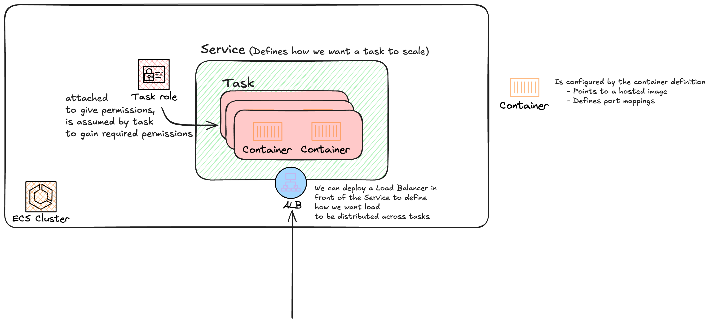

# Elatstic Container Service

A product that allows you to deploy containers on infrastructure that AWS fully or partially manages

The top level unit of configuration is a **Cluster** that runs in one of two modes:
- **EC2 mode** which uses ec2 isntances as container hosts that run the ECS software.
- **Fargate mode** where AWS manages the host.

It is much easier to understand the overall architecture via a diagram.

## EC2 & Fargate mode

### EC2 mode

The cluster itself must be part of a VPC that runs in two availability zones.
You containers run on EC2 instances that are part of a Auto-Scaling Group.
The container images themselves are hosted in a registry of your choice.

**The main point is that ECS handles task deployment to EC2 hosts, but the capacity of the cluster (how many hosts are in the cluster) is managed by you.**

### Fargate mode
The cluster is still deployed in a VPC which needs to run in two availability zones.
In Fargate mode, you don't need to manage any infrastructure. It is a cluster model where you don't need to manage any hosts yourself. It is ECS's responsibility to find a host for your tasks to run. 

AWS has a managed shared Fargate infrastructure platform. You gain access to resources of a shared pool, but you have no visibility of other customers.

**Each task is running on shared infrastructure, but from a networking perspective, they are injected into the VPC and is given a elastic networking interface which gets a I.P address within the VPC.** They can be accessed from within the VPC, and from the public internet if the VPC is configured to allow that.

### When to use EC2, ECS (EC2 mode), or Fargate.

**If you're using containers** -> ECS
**EC2 mode** when you have very large workload, are price conscious, and when the admin overhead costs are worth the savings from managing your own infrastructure.
**Fargate** 
- Because it's pay as you consume, and you don't have visibility into costs, it's best to use when you want to reduce admin overhead.
- For small / burst, or batch / periodic workloads that last longer than 15 minutes. (Otherwise consider lambda).