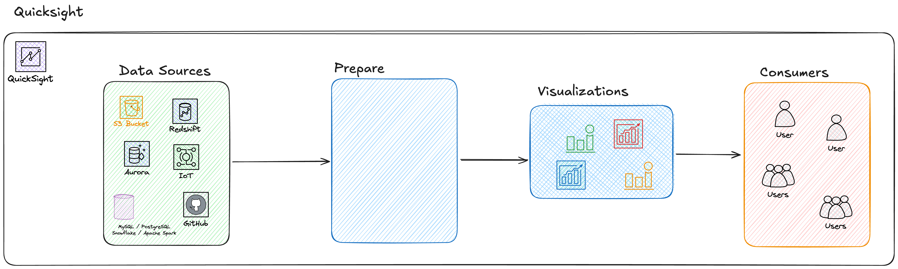

# Big Data, and Analytics

## Quicksight

Quicksight is a Business analytics / intelligence service.

It is used for visualization and Ad-hoc analytics.

It is priced per 30-min windows. 

Data sources include:
- AWS services
    - Athena
    - Aurora
    - Redshift
    - S3
    - IOT
- Jira, Github, SalesForce
- Postgres, Spark, Snowflake, MySQL
- CSV, JSON

