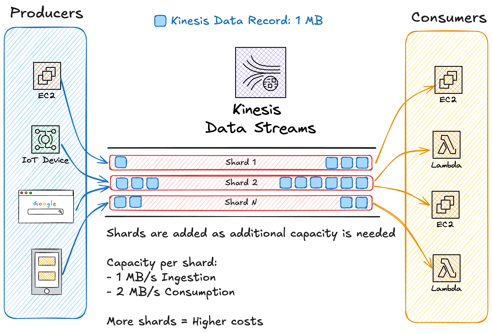
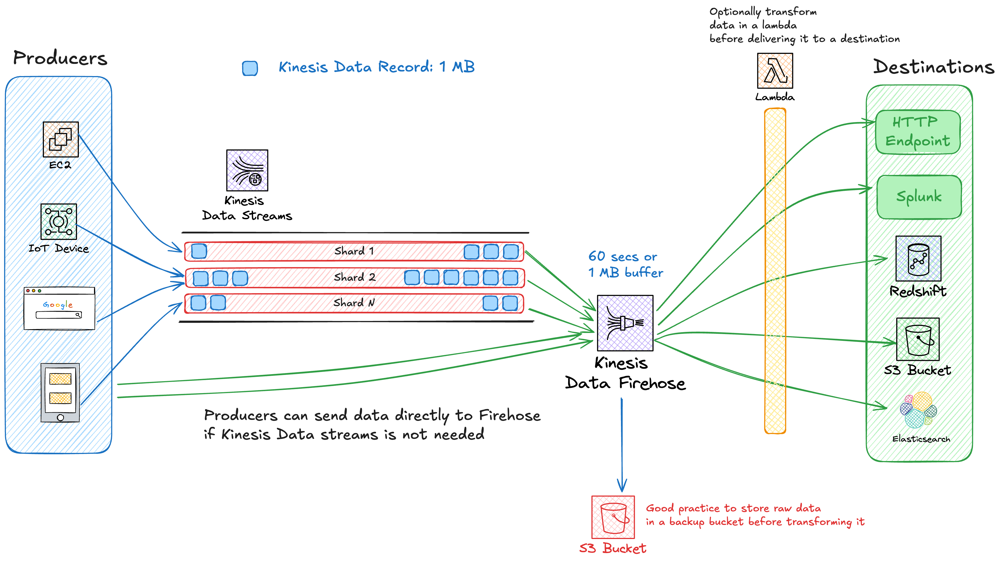
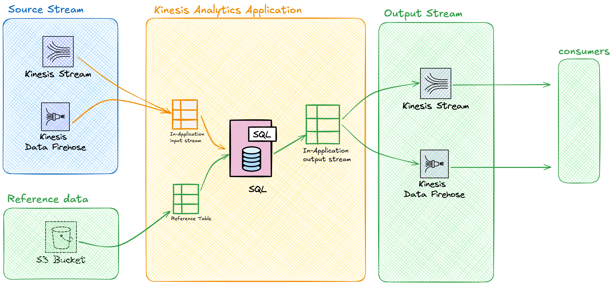

# Kinesis Data Stream

## Main usage

Data ingestion for Real-Time Analytics, Monitoring, App clicks, Sensor data ingestion, real-time user behaviour tracking, etc...

## Features

It is a public service and is highly available by design.

Kinesis is designed to ingest huge amounts of data from a lot of sources. It is a log-based message queue designed for large-scale data ingestion.

**Producers** send data into a kinesis **stream**.

**Streams** can scale from low to near near infinite  data rates.

**Streams** store a **24-hour** moving window of data. This window can increase to a maximum of 365 days at additional costs.

Multiple consumers can access that data from that window.

### Streams

Data is stored as a **Kinesis data record** on a stream.
A stream is how you scale kinesis, more traffic = more streams.

#### Capacity
- Ingestion: 1 MB/s
- Consumption: 2 MB/s
- Kinesis Data record: 1 MB

## Differences with SQS

SQS is used to decouple system component between 1 type of producers (ex: web tier), and 1 type of consumers (ex: a worker tier). It's used to decouple asynchronous communication.
The other main difference is that messages in a SQS queue are deleted after being consumed, there is no persistence.

The last and most important one is that Kinesis is designed for very large scale data ingestion and streaming to **multiple** consumers and types of consumers that read the data in difference ways.

# Kinesis Firehose

## Usage

Firehose is used to persist data beyond the kinesis data streams rolling window.
It is a fully managed service to load data for **data lakes, data stores, analytics services**.

## Features

It's fully serverless and resillient.

**It is a near real-time product** at about ~60 seconds.
It supports transformation of data on the fly by integrating a lambda function.
Billing is volume-based.

## Available destinations
- S3
- HTTP Endpoint
- Splunk
- Redshift
- Elasticsearch

### Muts knows

Data sources can be either a Kinesis Data Stream, or data producers can push data to firehose directly.
Firehose buffers data for 60 seconds, or 1 MB of data before delivering it to a destination. Which is what makes it near real-time.

# Kinesis Data Analytics

Enables real-time data processing using SQL

It ingests data from Kinesis Data Streams or Firehose, and can pull in static reference data from S3.
Input streams and reference data are represented as tables inside the Kinesis Data Analytics Application, which allows you to run your queries on them.

Query output data can be sent to a destination. The supported ones are:
- Firehose, and thus S3, Redshift, Elasticsearch & Splunk. But that means that output is not real-time anymore, but near real-time because of Firehose's buffer.
- Lambda
- Kinesis Data Streams

It is meant to live between a input stream and a output stream.

