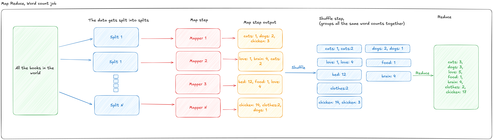

# Big Data, and Analytics

## MapReduce, general

Is a data analysis architecture made for large-scale **parallel** processing of **enormous amounts** of data.

It's composed of two phases: a **Map** step, and a **Reduce** step.

Optionally, you can have a **Combine** and **Partition** step.

Data is separated into 'splits' that get transformed and later merged back together to produce the final output.

A Map Reduce job typically runs on top of a Hadoop File System, which is a file system stored across many nodes of a Hadoop cluster.
Data on that system is typically replicated across nodes to avoid any data loss. 

There are two types of nodes that power a HDFS:
- **Data nodes** that hold data.
- **Name nodes** provides visibility into the system and controls access to it.

## EMR, Elastic Map Reduce

### Main usage

Evidently, EMR is used for Big data processing, manipulation, analytcs, indexing, transformation, and more. 

It is used 'under the hood' by AWS's data pipeline product.

### Features

Elastic Map Reduce (EMR) is the AWS Managed implementation of Apache Hadoop within AWS. Apache Hadoop is a implementation of the MapReduce framework.

EMR also includes other elements of the Apache ecosystem like : Spark, HBase, Presto, Flink, Hive, Pig.

It is complex to provision and maintain a Hadoop cluster. EMR gives organizations the ability to provision a Hadoop cluster with much less overhead.

EMR can run long-term clusters, but also ad-hoc / transient clusters. This allows you to have either 1 long-running cluster that runs multiple jobs over time, or provision a cluster to run a job, and terminate it when the job is complete.

### Must knows

EMR runs in 1 Availability Zone in a VPC using EC2 for all of its nodes. This is required because of the high-speed traffic requirements of hadoop.
But that means that all the compute and storage it uses must be in that same AZ, which has high-availability and FT implications.
EMR can use **Spot, Instance fleet, Reserved, or On-demand**.

### Architecture

### How to plan for pricing strategy.

The first to think about when considering EC2 purchase options for EMR is how long the cluster will run for.

- If you use 'On demand', you can use **savings plans** or **reserved purchases** to reduce the cost.
- If you use 'Spot instances' for the Master Node, you might as well use spot for everything else, since everything will fail if the master node fails.
- Generally, task nodes are the best candidate for 'spot instances', because they can be restarted.
- It's best to use long running instances for the Master and Core nodes.