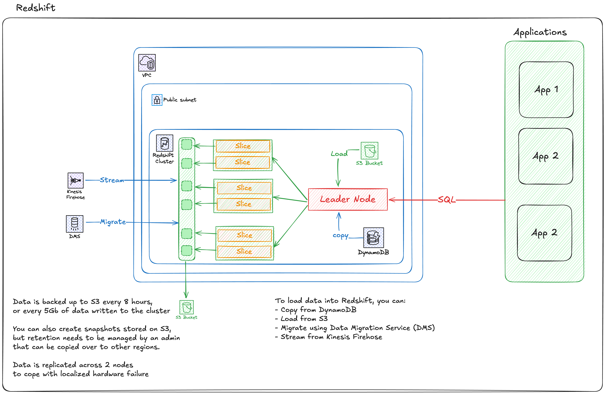

# Big Data, and Analytics

## Redshift

Is a Petabyte-scale database meant to be used as a data warehouse for reporting and analytics. It is essentially a OLAP database.

As opposed to RDS (OLTP / Online Transaction Processing), OLAP databases are designed for queries and analysis of aggregated data from OLTP systems.

It is a column based database that is pay-as you use.

You can provision it, load data into it from RDS, do the work you want, and deprovision it.

You can use Redshift spectrum to query data directly from S3, or use **federated query** to query other DBs and sources like S3.

It integrates with Quicksight for visualization, and has a SQL-like language for data access (supports jdbc/odbc connections).

### Architecture

It is server based, and has a cluster architecture. It runs on multiple nodes, and is provisioned in a single AZ in a VPC because nodes require high-speed networking to communicate between them.

**Leader Node**: Manages communication with client programs and compute nodes. Develops execution plans to carry out queries, planning and aggregation.
**Compute Node**: Performs queries of data, and store the data loaded into the system. A compute node is partitionned into slices.
Each slice is allocated a portion of the node's memory and disk space. 

The leader node manages distributing data to the slices, and the workload to slices.

Slices work in parallel to complete operations. A node can have 2/4/16/32 slices, depending on the resource capacity of that node.

#### VPC Security 

Because Redshift lives in a VPC, all parts of the system can be managed:
- VPC security controls, 
- IAM Permissions
- KMS for at-rest encryption
- CloudWatch monitoring

#### Enhanced VPC routing

By default, Redshift uses public routes for traffic when communicating with external services, or any other AWS services when it's loading data.

With Enhanced VPC routing, traffic is routed using your VPC configuration. Which means it can be controlled by **security groups**, **NACLs**, **Custom DNS**, and will require the use of any VPC gateways that other type of traffic requires (VPC gateways, NAT gateways, etc...).

