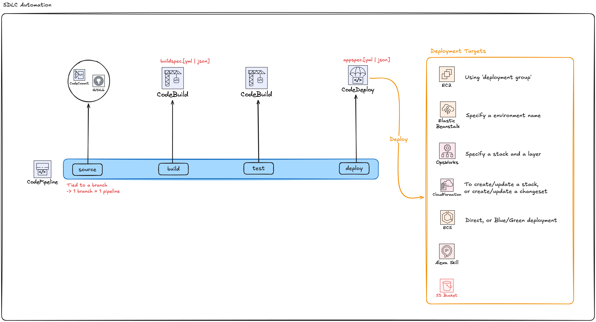
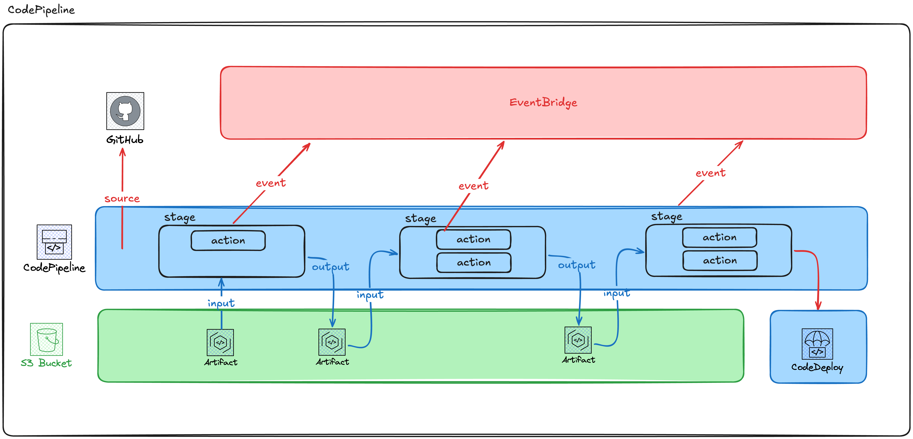
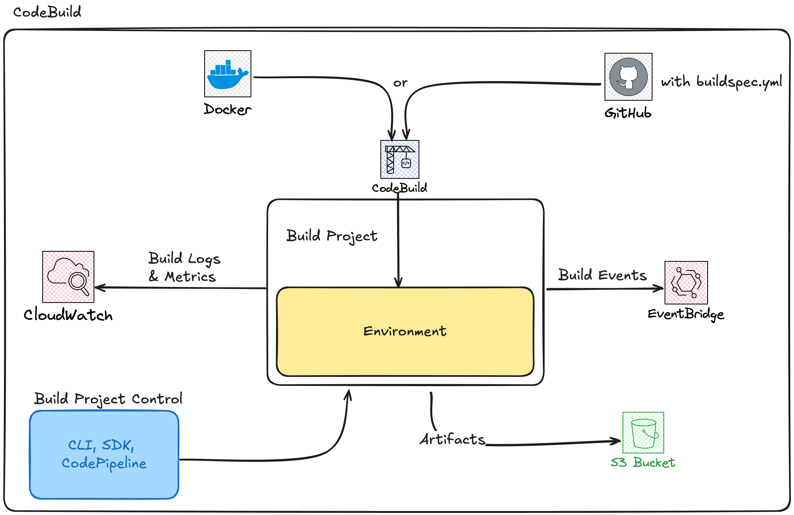
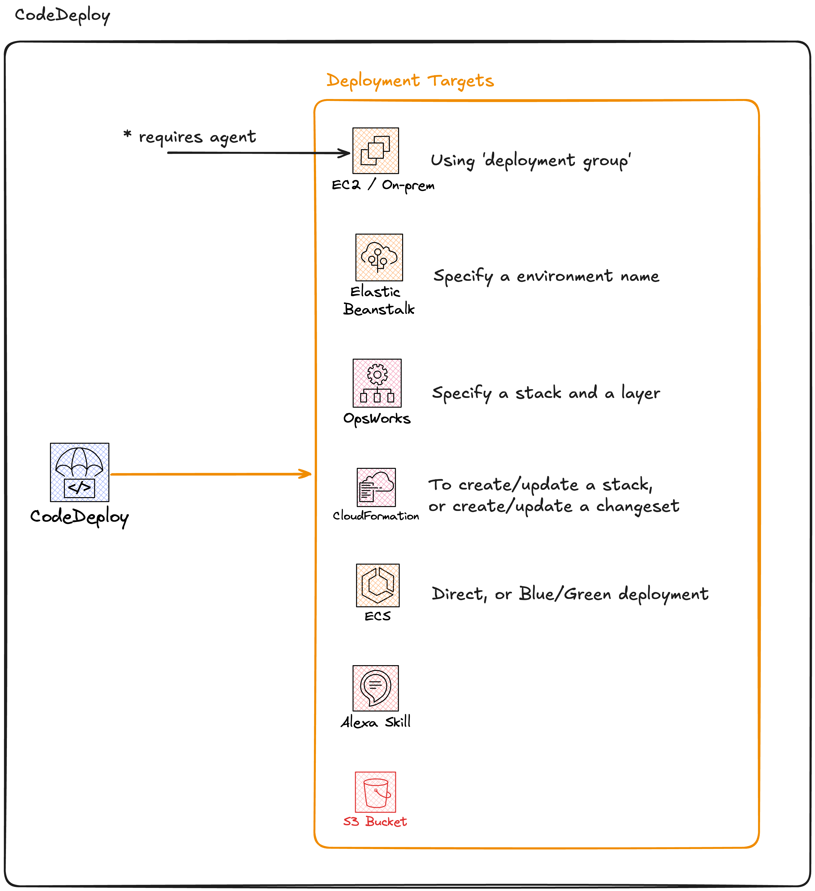

# Software Development Lifecycle Automation (CI/CD)

# Architecture



## CodePipeline

Is the glue that orchestrates CodeCommit, CodeBuild and CodeDeploy.

Pipelines are built from stages. You can have as many stages as you want. 
Stages contain actions that are sequential or parallel.

The movement between stages can be automatic or requires manual approval.

Stages can consume and generate **artifacts**, which are files that sre stored to an s3 bucket linked to the pipeline.

Any change to the state of pipelines, stage, or actions generates events that are published to the EventBridge event bus from which you can run lambdas or generate notifications.

You can interact using cloudtrail for monitoring API calls, or using the console UI for human interaction.



## CodeBuild

Allows you to control a fully managed build environment. You are only billed for the resources consumed during the build.

It can be used for builds and tests.

It uses docker to create consistent build environments.

It integrates with other AWS services:
- KMS for encryption
- IAM for permissions
- VPC for networking
- Cloudtrail for API autiding
- S3

It can send logs to S3 and Cloudwatch Logs,
Send metrics to CloudWatch
And pushes build events to EventBridge.

Supported build environments: Java, Ruby, Python, Node, PHP, .NET, Go ...

### Build Project and Environment

You can define the environment the build is ran by two methods:

- A existing docker image
- Using the `buildspec.[yml | json]` file which must be located in the root of the application.

#### Build Project integrations



#### The `buildspec` file.

Four main phases

- `install`: install packages in the build environment
- `pre_build`: sign-in to things or install dependencies
- `build`: to tun the commands to build the source code
- `post_build`: package things up, push docker image, send notifications.

You can also declare `env` variables, and also integrates with parameter-store or secrets-manager.

Artifacts allows you to define artifacts and where they're stored.

Ex:

```
version: 0.2

env:
  variables:
    ENV_VAR_1: "value1"
    ENV_VAR_2: "value2"
  parameter-store:
    PARAMETER_1: "/my/parameter/store/path1"
    PARAMETER_2: "/my/parameter/store/path2"
  secrets-manager:
    SECRET_1: "arn:aws:secretsmanager:region:account-id:secret:my-secret"

phases:
  install:
    commands:
      - echo Installing dependencies...
      - apt-get update
      - apt-get install -y jq
      - npm install
  pre_build:
    commands:
      - echo Running pre-build commands...
      - echo Environment Variable 1: $ENV_VAR_1
      - echo Parameter Store Value: $PARAMETER_1
      - echo Secrets Manager Value: $SECRET_1
      - npm run lint
  build:
    commands:
      - echo Running build...
      - npm run build
      - npm test
  post_build:
    commands:
      - echo Build completed, running post-build steps...
      - aws s3 cp ./build s3://my-bucket/build/ --recursive
      - echo Build and artifacts uploaded to S3

artifacts:
  files:
    - '**/*'
  base-directory: build
  discard-paths: yes
  name: my-artifact-${CODEBUILD_BUILD_ID}.zip

cache:
  paths:
    - node_modules/**/*
```

## CodeDeploy

Is a Deployment as a service product. It deploys code, not resources.

Integrates with many AWS services, and especially well with the **Code*** products.

**Requires a agent to be installed for deployments to EC2 instances or On-prem infra.**



### The `Appspec.[yaml | json]` file

Defines how to manage deployments, in terms of config and the lifecycle event hooks.

There are two major sections of the file: config, and hooks.

- Config: 
    - Files -> applies to: EC2 / On-premise servers. Tells CodeDeploy which files should be installed.
    - Permissions -> applies to: EC2 / On-premise servers.
        - Details any special permissions and how they should be applied to the files defined in the `files` section.
    - Resources -> applies to: ECS / Lambda.
        - Lambda: contains name, alias, current version, target version.
        - ECS: task definition, container, port.

- Hooks:
The function of these hooks depend on the platform of the compute you're using for your deployment. It changes if you're using EC2 / On-premise, Lambda or ECS.

- `ApplicationStop`: Used to prepare for the actual deployment
- `DownloadBundle`: When the CodeDeploy agent copies the application down to a temp location.
- `BeforeInstall`: For pre-installation tasks: Create files, backups.
- `Install`: CodeDeploy agent copies the application file from the temp location to the final destination folder.
- `AfterInstall`:  To run po-install steps: application config, licensing.
- `ApplicationStart`: To restart / start services stopped during the `ApplicationStop` step of the deploy.
- `ValidateService`: Verify that the deployment was completed successfully, check logs, run tests, etc...

- EC2 / On-premise -> 1 or more script gets run for each Hook.
- Lambda / ECS -> Each hook specifies a Lambda function to run for each hook.


Ex:

```
version: 0.0
os: linux

files:
  - source: /src
    destination: /var/www/html
  - source: /config
    destination: /etc/myapp

permissions:
  - object: /var/www/html
    pattern: "**"
    owner: www-data
    group: www-data
    mode: 755
  - object: /etc/myapp
    pattern: "**"
    owner: root
    group: root
    mode: 644

hooks:
  BeforeInstall:
    - location: scripts/install_dependencies.sh
      timeout: 300
      runas: root
  AfterInstall:
    - location: scripts/change_permissions.sh
      timeout: 300
      runas: root
  ApplicationStart:
    - location: scripts/start_application.sh
      timeout: 300
      runas: www-data
  ValidateService:
    - location: scripts/validate_service.sh
      timeout: 300
      runas: root

```
