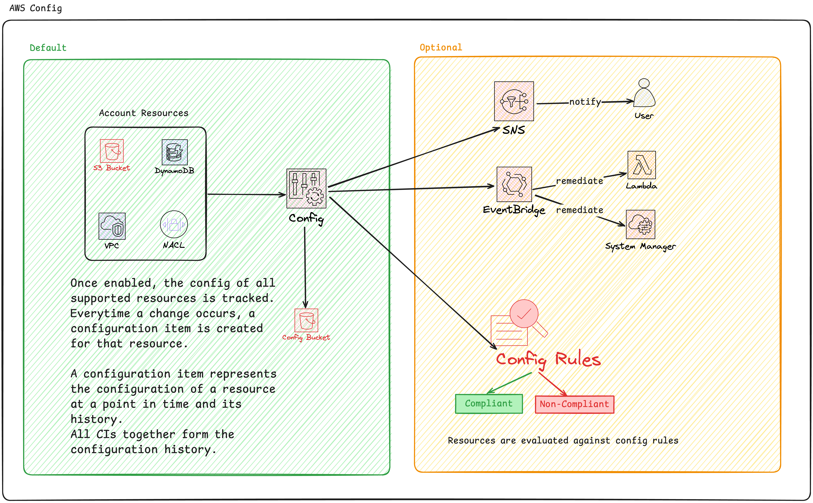

# AWS Config

It is a regional service, but can support cross-region and cross-account aggregation.

It allows you to track resource configuration changes over time.

What is stored is the resource config, it's relationships to other resources, and who changed it.

It's great to make sure resources are configed according to standards in your organizations.

**It does not prevent changes hapenning**.

Changes can generate SNS notificationsm and near-realtime events via EventBridge, and you can use lambda to trigger remediation steps.

## Architecture

## Config rules

Is where the true power of Config comes through.

Resources are evaluated against config rules that are either AWS managed or custom (using lambda).
These rules evaluate resources based on a predefined standard. Marking resources as either compliant or non-compliant.

Config can integrate with SNS or Event-Bridge to receive events, and:
- Invoke lambda functions to 'fix' the problem. (More for account-level resource config).
- or integrate with SSM to apply fixes to remediate issues. (More for instance config).

# Service Catalog

Is a document or database created by an IT team within a business.

It is a collection of products offered by a team. They are created by IT teams, but other teams can create their own versions.

AWS's service catalog is a portal for 'end users'.

Non-technical teams can use AWS Service Catalog to launch predefined products.

Ex: A blogging software that is sold by a sales team.

The admin defines the product in Cloudformation, along with permissions the product has, and end-user permissions.

Products can be grouped together to build **portfolios**.

Admins define products and portfolios using Cloudformation and Catalog configuration.