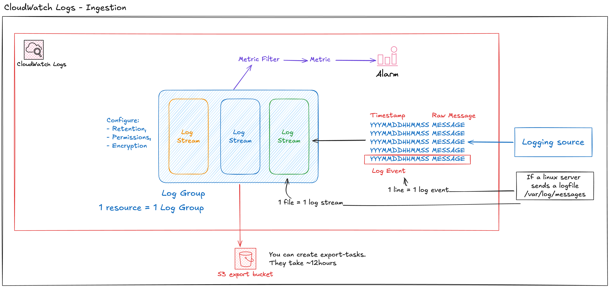
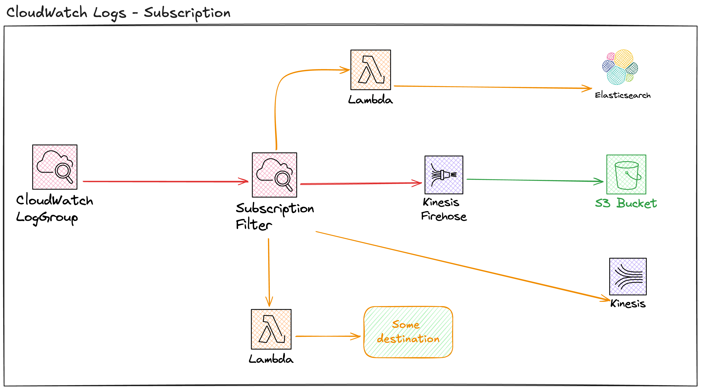
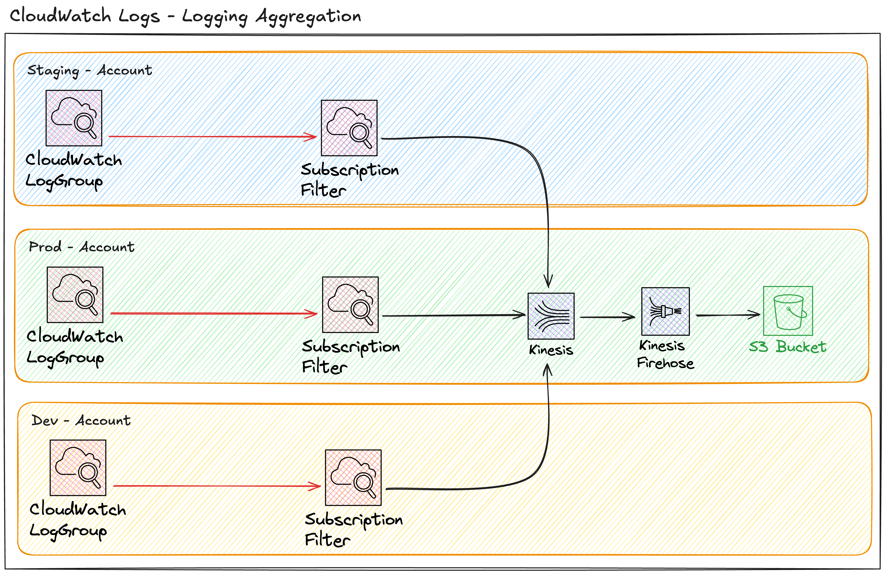

# Monitoring & Logging

## CloudWatch Architecture

Cloudwatch Is a metrics collection service that lives in the public AWS network.

Metrics get collected, which can trigger alarms that themselves trigger other actions like a step-function workflow / a auto-scaling group, or a notification to a an engineer.

### Terms

#### Namespace
Is a container for metrics, ex: AWS/EC2 or AWS/Lambda for AWS namespace.
Or Petsdeli/Pdex

#### Datapoint 
Is a single ewntry which is comprised of Timestamp, Value, unitof measure (optional)

#### Metric
Is a time ordered set of data points with a name Ex: CPUUtilization, NetworkIn, DiskWriteBytes.

Every metric has a MetricName and a Namespace.

#### Dimension

It is a Name/Value pair.

It is a way to differentiate/attach/associate metrics to instances of the same type, ex: ec2 / lambda.

It's essentially a grouping mechanism, similar to key value identifiers.

You would attach a dimension to a Metric, to associate it to a specific instance and allow you to aggregate data.

Ex, you can attach multiple dimensions to a instance: 
- Name=InstanceId, Value=i-1111
- Name=InstanceType, Value="Linux"

### Resolution & Retention

| Resolution | Retention |
|----------|----------|
| < 60s |   3 hours |
| 60s | 15 days | 
| 300s | 63 days | 
| 3600s | 455 days | 

Resolution can be as low as 1s. It is the interval at which a datapoint is collection.

As data ages, its aggregated and stored for longer with less resolution.

You can apply **statistics** to data, which is an aggregation over a period, ex: Min, Max, Sum, Average.

**Percentile**, is a representation of how much of the data set is below a certain value. 
The alarm enters the ALARM state if it crosses specified threshold.
You can trigger one or more action from an ALARM.

### Alarm

An alarm watches a metric over a time period. It is either in the ALARM or OK state.

## CloudWatch Logs

It is important to understand the product as two parts: The **ingestion**: (writing logs) and **subscription** (reading logs) part.

It is a public service designed to store, monitor and provide access to logging data from any source (AWS, On-premise, IOT, or anything else).

- Most self managed applications would need the agent to be installed. It would allow you to log system or application logs.
- Also supports VPC flow logs, cloudtrail logs, Elastic Beanstalk, ECS container logs, API GW, Lambda execution logs.
- Also Route53 DNS logs.

### Ingestion

#### Log Group

- Store login data indefinitely by default, but retention can be adjusted to control costs.
- Permissions can be set to control who has access to them.
- You can use KMS to encrypt logs at rest.

#### Metric Filter
It gets defined on a log group, and looks for patterns on that log group, ex: server crash, failed ssh attempts. From identifying patterns, you can create and publish a metric. From which you can trigger alarms down the line.

#### S3 Exports
It is called `Create-Export-Task`.
Allows you to take logging data from Cloudwatch. It is a ~12 hour process.

### Subscription

Metric Filters are used to take logs out of Cloudwatch and into your preferred destination, either Kinesis Firehose, Lambda -> Elasticsearch, or Lambda -> Else

### Log aggregation

Log aggregation is a common architecture whereby you use metric filters to aggregate logs into a single destination.

## Cloudtrail

Is a regional service. But is not real-time!. It logs events ~15mins within the activity happening.

Cloudtrail is a product that logs API calls/activities. Each log is called a **Cloudtrail Event**. It is a record of an activity in a AWS account. This activity can be an action taken by a user, a role, or a service.

Events are stored by default for the last 90 days by default. It provides 90 days of history for a AWS account.

To customize the service, you need to create a **trail**.

Events can be categorized into two types of events:
- **Management events**: Events that hold information about management operations performed on the AWS account. These operations are also called **control plane** events. Ex: provision a EC2 instance, terminating it, create a VPC, etc...
- **Data events**: Contain information on operation performed ON a resource. Ex: Objects uploaded from S3, Lambda function being invoked.

By default, only Management events are tracked.

### A Trail

Is a unit of configuration within the cloudtrail product. Its purpose is to generate log files of events and put them in S3.

It logs events for the AWS region it is created in.

It can be configured to operate in either 1 region, or All regions.

A single region trail is only in the region it is created in.
A All-region is for all regions, but managed as 1 region. It supports newly added regions by AWS.

You can configure a trail to only log events for the region that it is in. But also for events from Global AWS services like IAM / STS / Cloudfront which always log to us-east-1.

A trail also allows you to store logs into an S3 bucket as a JSON format.
But you can also send events to Cloudwatch logs, which would allow you to search the logs or enable a filter metric.
You can now enable a Organization trail, which includes all regions, and all accounts in the organization.

#### Logfile Integrity.

The feature is called **logfile validation**.
Is a process of creating a checksum/digest for every logfile that is created, to make sure they have not been tampered with/edited to confirm their validity.

Digest files are stored in the same bucket as the logs, but in a different folder. Which means you can apply different security to those files to enable role separation.

Each digest file contains a hash for every logfile that is stored. And because of the nature of a hash, you can confirm that a logfile has not been changed.

Each digest file contains the signature of the previous one, allowing us to also confirm the chain/succession of files.

This is used to make sure that no one can cover their tracks after they do a malicious activity.

